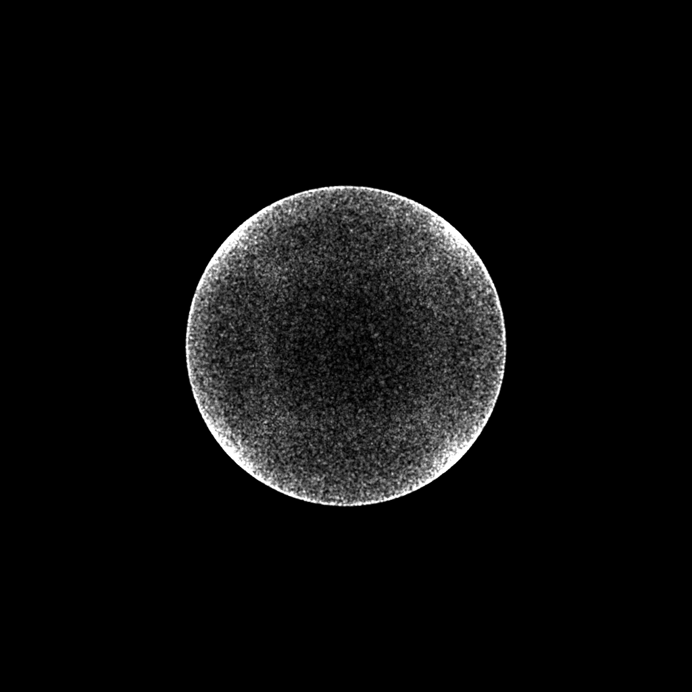
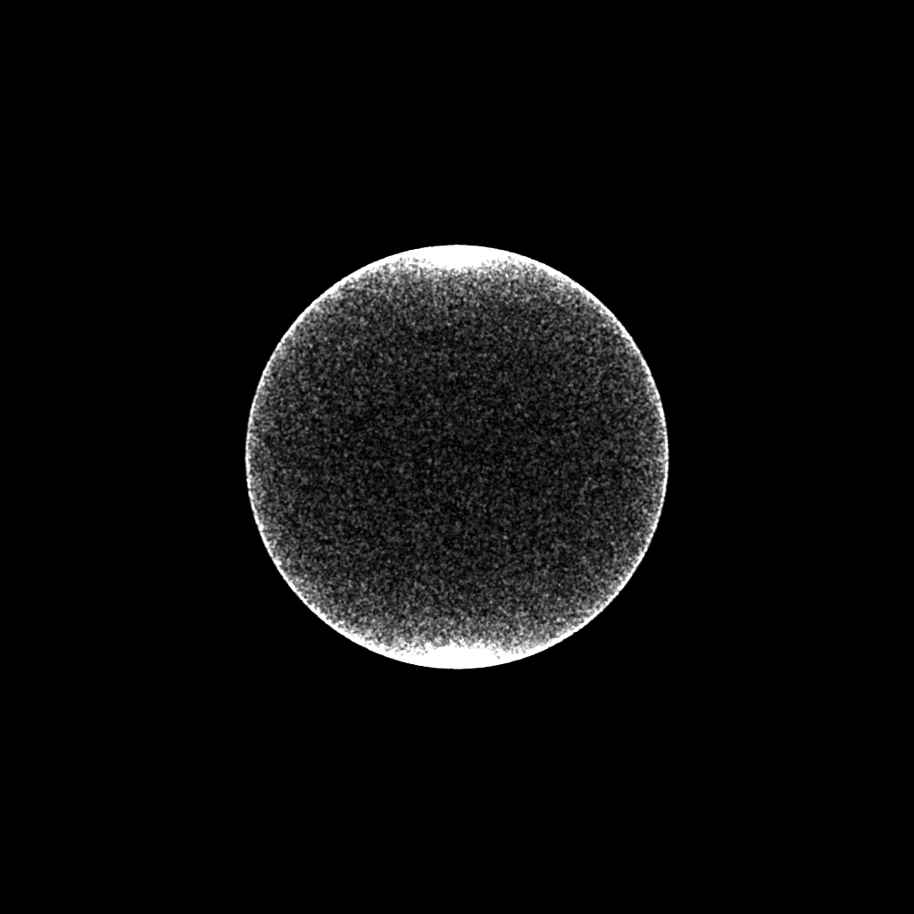
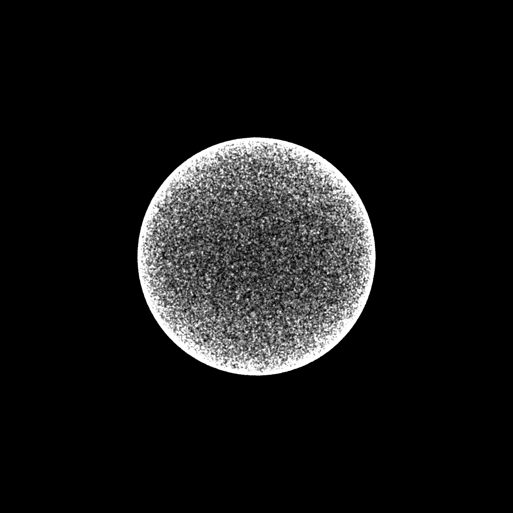
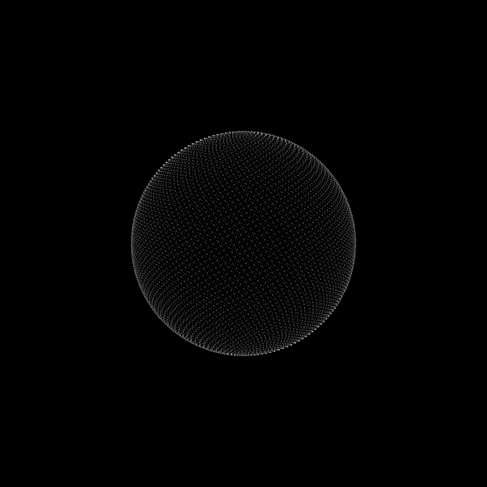

# Random Position On The Surface Of A Sphere
Sometimes you just need to postion things on the surface of a sphere. Here are a few methods I've used over the years.

Blog post coming soon.

100000 dots using getCartesianPositions() 
100000 dots using getSphericalPositions() 
100000 dots using getSphericalPositionsWithBias() 
100000 dots using getSphericalPositionsWithBias() 
10000 dots using getUniformPositions() 